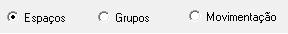
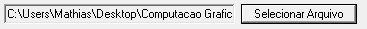
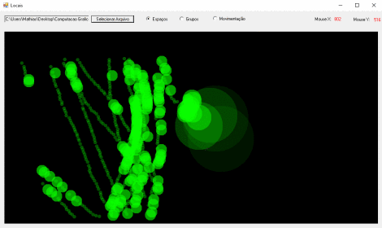
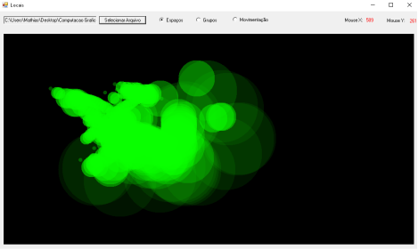
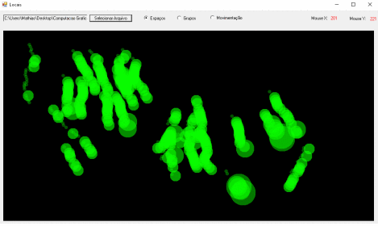
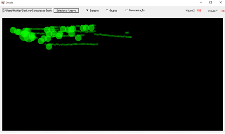
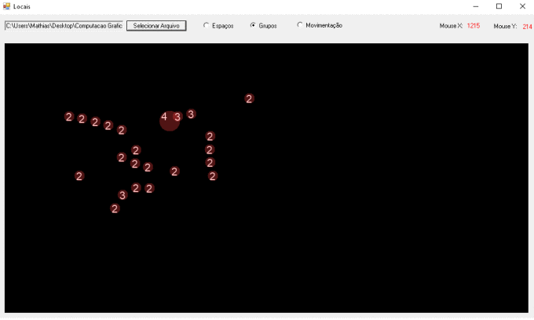
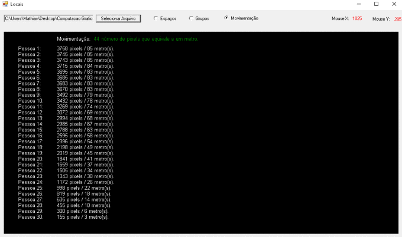

A análise será feita através de dados contidos em um arquivo chamado "Paths_D", este arquivo contém as coordenadas em pixels de cada pessoa parada ou em movimento que aparecem nos frames.

O projeto em questão analisa três eventos no vídeo, o primeiro aspecto analisado são as áreas mais utilizadas pelas pessoas em cada frame, resultando em um esboço dos locais mais utilizados no cenário. O segundo aspecto analisado é a formação de grupos entre essas pessoas, a definição de formação de grupo consiste em pessoas que estão próximas o suficientes para interagir. O terceiro dado levantado é a distância, tanto em pixels quanto em metros que cada pessoa percorreu durante o decorrer de todos os frames.

## Como utilizar a ferramenta?

1.  Selecione o tipo de evento a ser analisado.

    <figure>
    	
    </figure>

2.  Selecione o arquivo .txt a ser interpretado pelo programa.

    <figure>
    	
    </figure>

3.  Após informar estes dois parâmetros os dados serão gerados automaticamente.

#### Resultados:

Abaixo serão listados os resultados da análise dos arquivos txt(Paths_D) na seguinte ordem,

-   Paths_D.txt - BR.
-   Paths_D.txt - DE1.
-   Paths_D.txt - JP1.
-   Paths_D.txt - UK1.

## Áreas mais utilizadas pelas pessoas nos frames.

Coordenadas  BR
{: .notice}
<figure>

</figure>
Coordenadas DE1
{: .notice}
<figure>

</figure>
Coordenadas JP1
{: .notice}
<figure>

</figure>
Coordenadas UK1
{: .notice}
<figure>

</figure>

## Formação de Grupos.

Formação de Grupos, Paths_D.txt DE
{: .notice}
<figure>
    
</figure>

## Distância.

Distância percorrida, Paths_D.txt DE
{: .notice}
<figure>
    
</figure>

## Conclusão

Os três aspectos analisados podem ser usados das mais variadas formas, para extrair dados de diversos eventos cotidianos. Um exemplo seria utilizar o algoritmo de áreas mais utilizadas para detectar por exemplo onde o maior fluxo de pessoas se concentra, este dado por ser útil nos mais diversos projetos na área da arquitetura.

### Link's

Download do projeto com o código: <a href="https://drive.google.com/open?id=0B8sCkbWAECcZOG9kZVRwX2VFaTg">Aqui</a>.

Download da aplicação com as coordenadas: <a href="https://drive.google.com/drive/u/1/folders/0B8sCkbWAECcZUDExeUdiY0x5anc">Aqui</a>.
