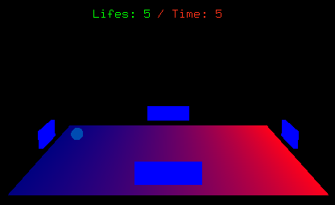

## Introdução

Game desenvolvido para a disciplina de Computação Gráfica I, ministrada pela Prof. Dr. Soraia Raupp. A proposta inicial foi um jogo no estilo "pong", onde o principal objetivo é não deixar bola sair do campo, quanto mais tempo o jogador permanecesse com a bola em campo, a dificuldade do game aumenta proporcionalmente.

## Funcionamento

A mecânica do jogo é bem simples, com as teclas direcionais o player controla as paredes cujo objetivo é não deixar o alvo (bola) sair do campo. Cada vez que a bola ultrapassa o limite do campo, o player perde uma vida.
Foram gerados 90 frames, totalizando 3 segundos de filme.

<figure>
	
</figure>

## Problemas encontrados

O principal problema encontrado no desenvolvimento do game foi o tempo de resposta para a ação da tecla pressionada, que compromete muito a jogabilidade, por isso o jogo encontra-se em versão BETA, outro grande problema foi o uso das texturas, eu particularmente tive bastante dificuldade em acoplar uma textura a algum objeto 3D do game.

## Conclusão

Através do desenvolvimento, deu para adquirir noções básicas na API <a href="https://www.opengl.org/">OpenGL</a> e na biblioteca <a href="https://www.opengl.org/resources/libraries/glut/">GLUT</a>. O executável pode ser encontrado no seguinte <a href="https://drive.google.com/open?id=0B8sCkbWAECcZN2pHRUMtSkg3MXM">link</a>, juntamente com o código fonte do game.
